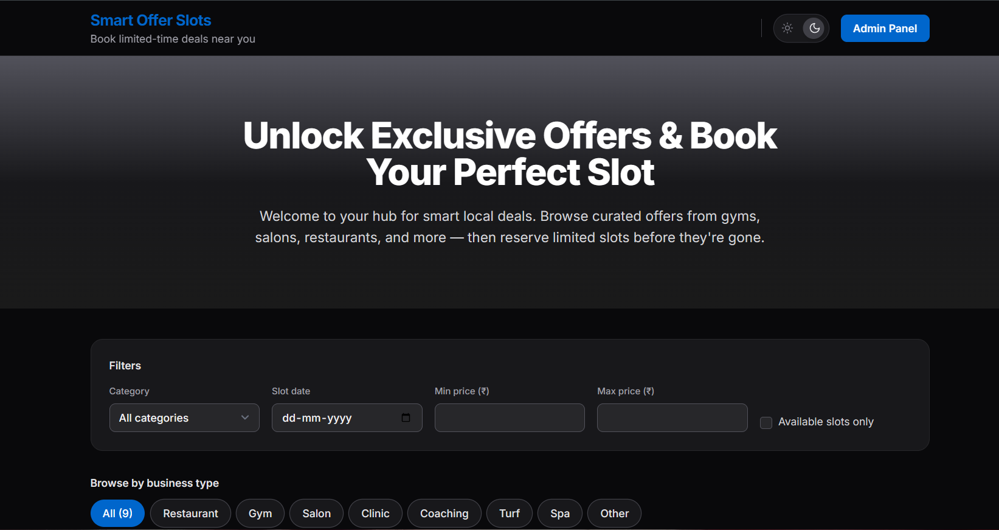
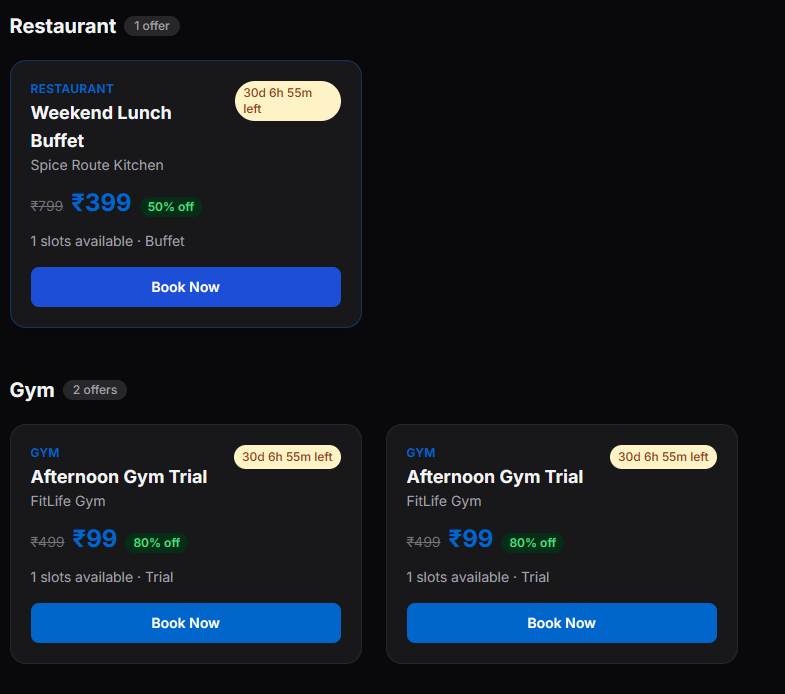
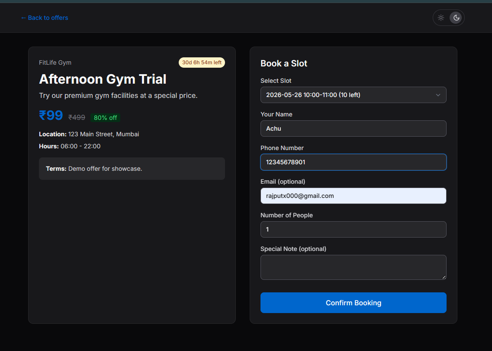
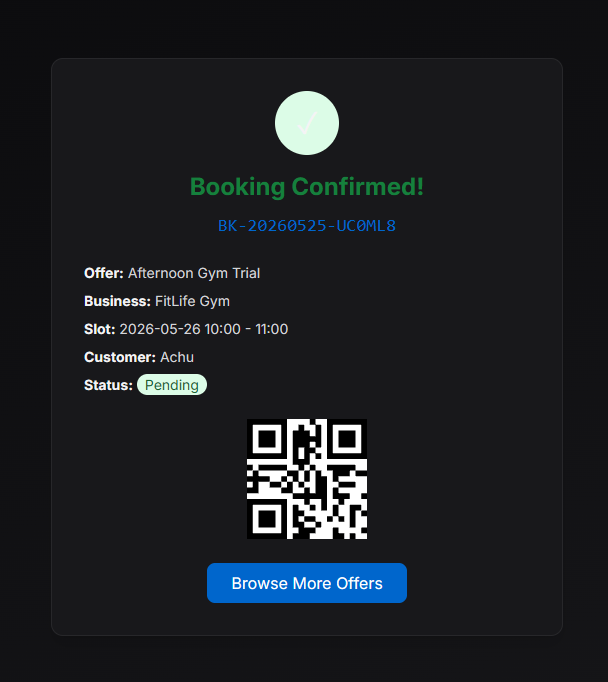
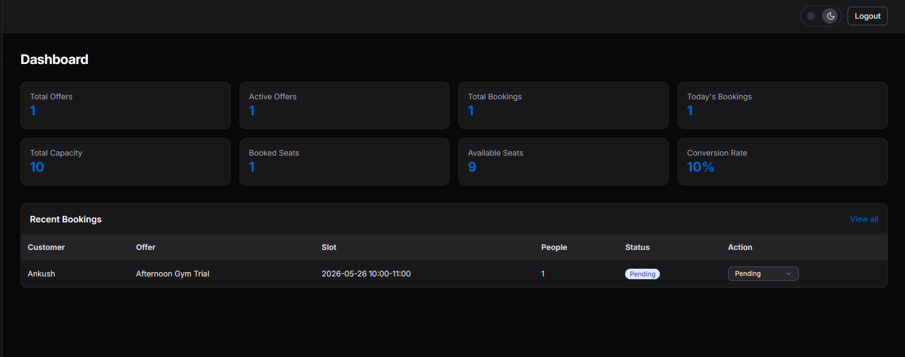
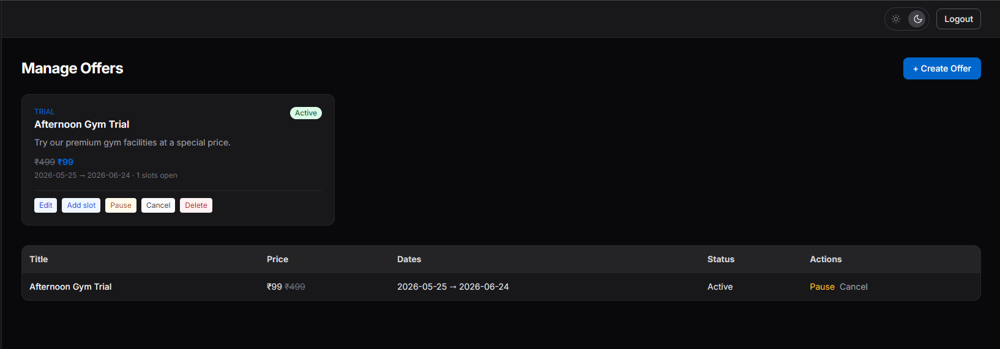
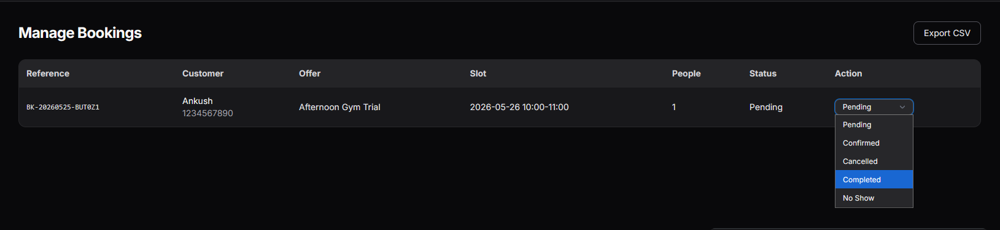
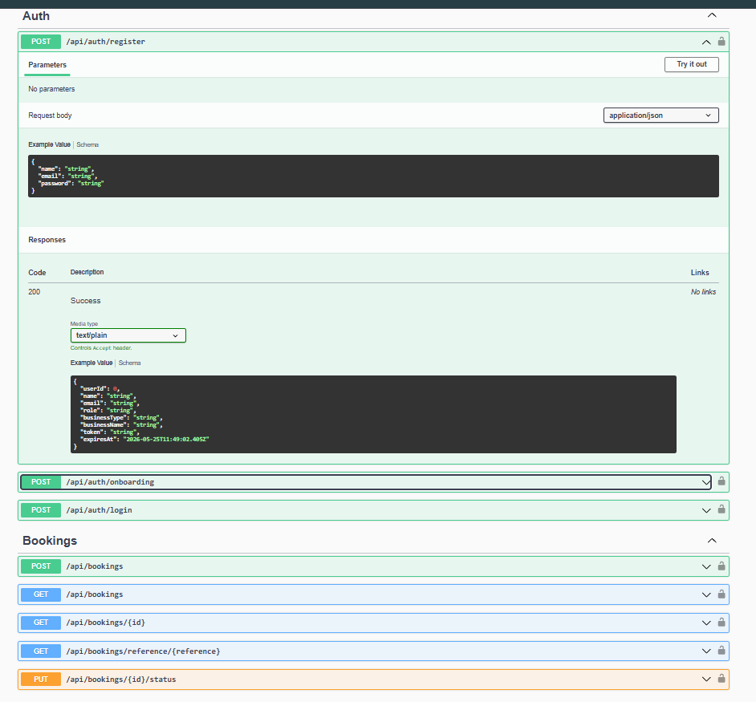

 # Smart Offer Slot Booking System


<p align="center">
  
</p>

<p align="center">
  Businesses create limited-time offer slots and customers book them through a public booking platform.
</p>

---

## Overview

Smart Offer Slot Booking is a fullstack booking platform built for service-based businesses like gyms, restaurants, salons, clinics, coaching centers, and activity spaces.

Businesses can create limited-time offers with booking slots, while customers can browse and reserve offers in real-time.

---

# Screenshots


## Browse Offers

<p align="center">
  
</p>

---

## Offer Detail & Booking

<p align="center">
  
</p>

---

## Booking Confirmation

<p align="center">
  
</p>

---

## Admin Dashboard

<p align="center">
  
</p>

---

## Manage Offers

<p align="center">
  
</p>

---

## Manage Bookings

<p align="center">
  
</p>

---

## Swagger API Documentation

<p align="center">
  
</p>

---

# Tech Stack

| Layer | Stack |
|-------|--------|
| Frontend | React, TypeScript, Tailwind CSS, Vite |
| Backend | .NET 8 Web API, EF Core, JWT Authentication |
| Database | PostgreSQL |
| API Docs | Swagger / OpenAPI |

---

# Features

## Admin Features

- Secure JWT authentication
- Business profile management
- Create/edit/pause/cancel offers
- Slot management
- Booking management
- Dashboard analytics
- CSV export support

## Customer Features

- Browse active offers
- Filter offers by category/type/date
- Real-time slot booking
- Booking confirmation page
- QR code confirmation
- Responsive mobile-friendly UI

---

# Dashboard Metrics

- Total Offers
- Active Offers
- Total Bookings
- Today's Bookings
- Total Capacity
- Booked Seats
- Available Seats
- Conversion Rate

---

# Quick Start

## Prerequisites

- .NET 8 SDK
- Node.js 18+
- PostgreSQL

---

## Backend Setup

```bash
cd backend/SmartOfferSlotBooking

copy .env.example .env

# Edit PostgreSQL credentials if needed

dotnet restore
dotnet run --urls http://localhost:5000
```

### Backend URLs

- API → `http://localhost:5000`
- Swagger → `http://localhost:5000/swagger`

Database is automatically created and seeded on first run.

---

## Frontend Setup

```bash
cd frontend

copy .env.example .env

npm install
npm run dev
```

### Frontend URL

- App → `http://localhost:5173`

---

# Demo Credentials

## Main Admin

| Email | Password |
|------|-----------|
| `admin@smartoffer.com` | `Admin@123` |

---

## Additional Demo Accounts

Password for all demo accounts:

```txt
Demo@123
```

Examples:

- `restaurant@demo.smartoffer.local`
- `salon@demo.smartoffer.local`
- `gym@demo.smartoffer.local`

---

# Implemented Screens

| # | Screen | Route |
|---|--------|-------|
| 1 | Admin Login | `/admin/login` |
| 2 | Admin Dashboard | `/admin/dashboard` |
| 3 | Create Offer | `/admin/offers/new` |
| 4 | Manage Offers | `/admin/offers` |
| 5 | Manage Bookings | `/admin/bookings` |
| 6 | Business Profile | `/admin/business` |
| 7 | Public Listing | `/` |
| 8 | Offer Detail + Booking | `/offers/:id` |
| 9 | Booking Confirmation | `/booking/confirmation/:reference` |

---

# API Endpoints

All required hackathon APIs are fully implemented.

Swagger Documentation:

```txt
http://localhost:5000/swagger
```

---

# Business Rules Implemented

- Offer price must be lower than original price
- Expired/cancelled offers hidden from public listing
- Slot capacity validation
- Per-customer booking limits
- Unique booking references
- Auto-updating booked seat counts
- Offer status management

---

# Bonus Features

- Live expiry countdown timer
- QR code booking confirmation
- CSV booking export
- Dark mode UI
- Responsive design
- Advanced public offer filters

---

# Project Structure

```txt
smart-offer-slot-booking/
│
├── backend/
├── frontend/
├── screenshots/
├── README.md
├── DATABASE_SCHEMA.md
├── ARCHITECTURE.md
└── .env.example
```

---

# Documentation

- `DATABASE_SCHEMA.md`
- `ARCHITECTURE.md`
- `IMPLEMENTATION_GUIDE.md`
- `QUICKSTART.md`

---

# License

MIT License

Hackathon submission for Willovate Smart Offer Slot Booking System.
